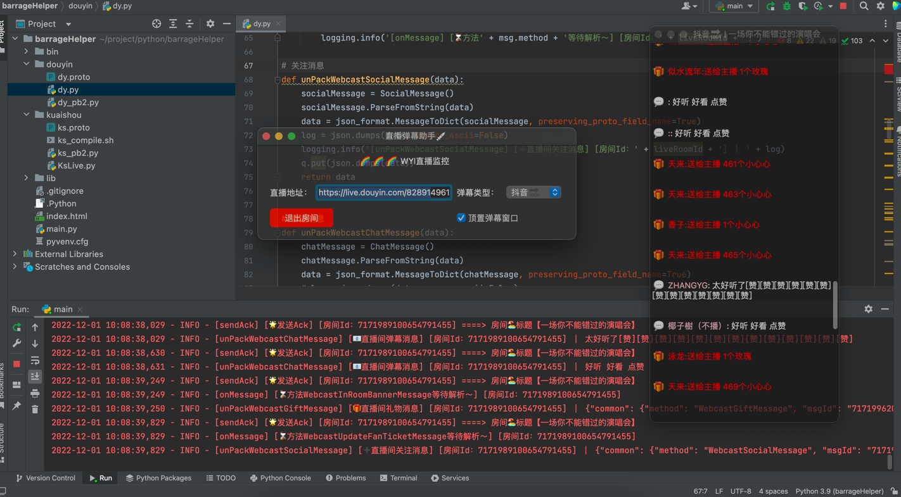

# 抖音网页版协议 👋
## 版本更新记录📝
| 版本   | 更新内容                                                                             | 完成状态     | 更新时间       |
|------|---------------------------------------------------------------------------------------|----------|------------|
| v1.0 | 完成第一版抖音弹幕协议更新 （熬了好几夜一直是无法连接抖音ws，还特意去了解了一下ws底层远离，人都快痿了，最后坚持完成✊）            | ✅        | 2022.12.03 |
| v1.1 | 抖音协议更新&增加用户信息字段                                                                      | ✅        | 2023.01.13 |
| v1.2 | 修复Go服务端数据补全问题                                                                         | ✅        | 2023.02.01 |
| v1.3 | 重构Go快手抖音服务端（增加代理IP传参,废弃PHP版本服务端，补全接入文档说明，增加`哔哩哔哩｜Bilibili`API接口【点赞、评论、分享、收藏、投币】）    | ✅        | 2023.02.15 |
| v1.4 | 升级抖音协议                                                                              | 进行中... ⏰ | 2023.05.23|

## [快手请移步👉](https://github.com/YunzhiYike/kuaishou-live)

## [bilibili接入文档👉](https://github.com/YunzhiYike/bilibili-openAPi)

## 🪧 学习交流&兼职
| 群名称    | 传送门                                       |
|--------|-------------------------------------------|
| 代刷社区| [✈️](https://t.me/+RqiGy8UPvF82Mjgx)  |
| Js逆向交流群| [✈️](https://t.me/+vXOgs2SEJW4wZjAx)      |
| 软件兼职任务发布总群| [✈️](https://t.me/+DQheyY3sEEg0OWVh)      |

## 🧪私有化抖音&快手弹幕服务
> 背景：考虑到开发语言各有不同所以对协议的拆解二开需要花费很多的时间，亦或者说对于萌新同学来讲上手程度太高
> 为此，我们给大家提供了免费的抖音直播推送服务。当然我们也可以支持定制化服务部署（收费）～～

### 接入教程视频 (不懂接入的👀看这里)
[【抖音直播弹幕协议开发（支持所有编程语言开发）！！！】]( https://www.bilibili.com/video/BV1nK411z7uh/?share_source=copy_web&vd_source=71e28910aae780b1b2052c3052b8a2e8)

## 测试注意⚠ ：因为风控原因开放服务可能不能正常使用可以️联系我们提供免费测试～～ 

## 📮 联系 `wuaiyiyun2022@163.com` | ✈️TG `yunke88` | 🐧QQ `2185312839`

### 服务地址
> websocket地址：ws://42.193.254.253:3000/dy

### 连接说明 ⬆️
#### 1、首次连接发送数据格式
```json
{"url":"电脑网页版抖音直播间地址（必填参数）","proxyIp":"代理IP（此字段不是必填，不填则走原服务器IP）"}
```
#### 2、连接后心跳说明
>为了提供资源可用性我们需要在3分钟内发送一个心跳包，包内容就是一个文本`ping`（小写哦～）
##### 2.1、Go模拟发现心跳包代码 🌰
```go
    data := "ping"
    err := ws.WriteMessage(websocket.TextMessage, data)
    if err != nil {
        log.Fatalln(err)
    }
```

### websocket连接测试


### 抖音直播间信息API接口调用 [👉猛戳我查看文档👈](https://console-docs.apipost.cn/preview/bdf25a21bc341bab/3dfc2f784646d7f7?target_id=d187f738-7580-46b1-b804-013d611f6cc8)
> 首先感谢小伙伴的长期支持，伴随着各种业务的加入需求换各有千秋，所以我们针对于有能力的开发者提供了API接口形式的对接；
> Q：前者不是已经有了独立ws服务部署吗？为什么还需要这个呢？A：ws服务部署会建立`2个连接`一个面向抖音一个面向客户端这样对于一些侧重于
> 重客户端轻服务端的来讲并不是很友好～～所以为此我们提供了解析抖音直播间


## 🐂功能
- [X] 直播
  - [X] 弹幕采集（进入、礼物、发言、关注、点赞、商品信息）
- [X] 短视频
  - [ ] 私信（已加入未来规划）
  - [ ] 点赞、评论、收藏、转发（已加入未来规划）
- [X] 成品开发
  - [X] 抖音弹幕采集
- [ ] 待定.........

## ⛽️ 鼓励一下～
> 逆向是一个很枯燥的活，开源更不容易～～请动动您的小手给个`start`吧～

## [💰 自营代刷社区👈](http://99.mmvp.ga)
## [🍭 短信接码平台👈](http://openapi.mmvp.ga)
> 最近收到很多小伙伴需要账号注册为此我们提供了注册平台～～～


## 💻 逆向技术
1. 谷歌浏览器 （抓包分析工具）
2. PyCharm  （编写代码）
3. protobuf （谷歌发明的一种通信协议）
4. Charles （抓包分析工具）

## ☕️ 轻松一下（作品展）
> 打个广告🪧～～ 需要直播监控的可以📮联系 `wuaiyiyun2022@163.com`
> 承接 Web、小程序、爬虫、网络代刷、建站、嵌入式、QQ 微信机器人开发等等 
> 擅长语言 `PHP` `Golang` `Python` `Java` `易语言`



## 使用说明📖
> 运行前请重新生成一下protobuf文件，因为机器系统不一样同时protobuf版本也不一样所以不能拿来直接用～
```shell

protoc -I . --python_out=. dy.proto

```

## 安装websocket依赖
```bash
pip install websocket-client
```

## 方法列表🚗
| 方法名称                | 类型       | 参数说明                                    | 说明        |
|---------------------|----------|-----------------------------------------|-----------|
| dy.parseLiveRoomUrl | `直播` | `url`：电脑网页版直播地址  | `启动抖音客户端` |


## 逆向视频教程
1. [【快手直播间弹幕采集协议分析第一课】](https://www.bilibili.com/video/BV1ZR4y1o7Ab/?share_source=copy_web&vd_source=71e28910aae780b1b2052c3052b8a2e8) 

> 本协议仅供学习参靠请勿非法用途，否则后果自负，与作者无关！

